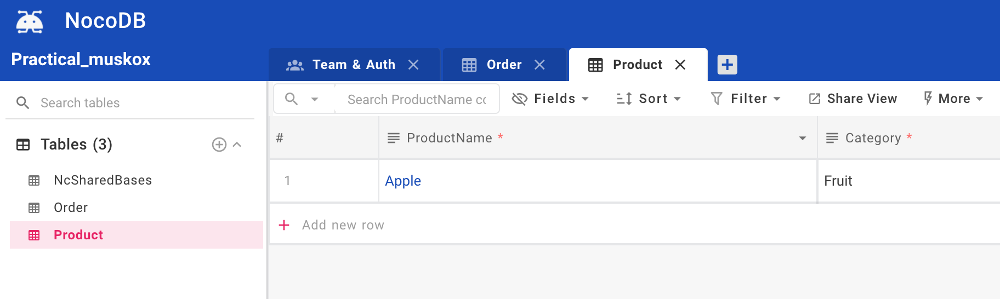
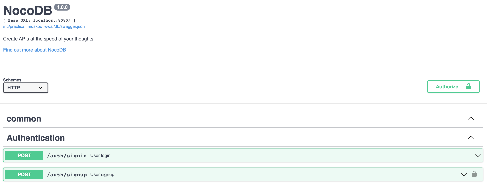
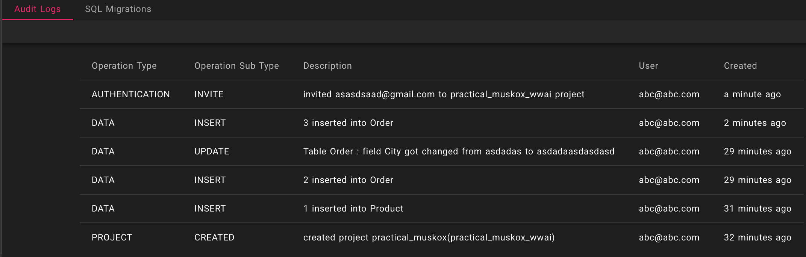

# noco-life
No code implementation using [NocoDB](https://github.com/nocodb/nocodb)

# Setup
```
docker-compose up --build
```

# Features

## Table Management



## REST / Graph Endpoints



## Audit Logging

